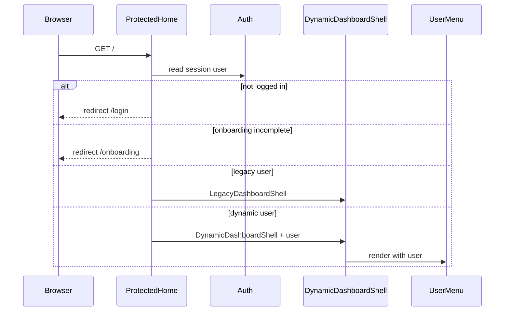
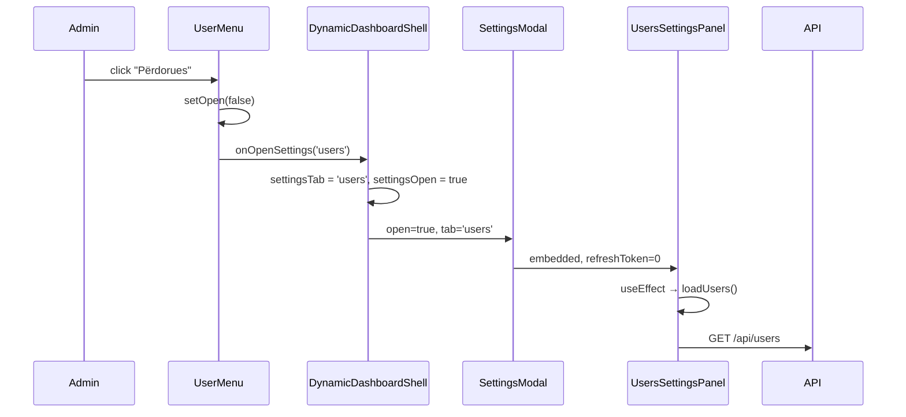
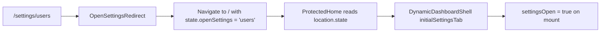
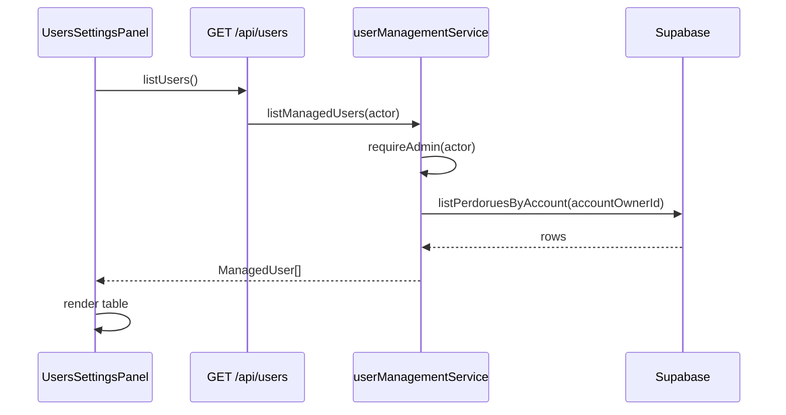
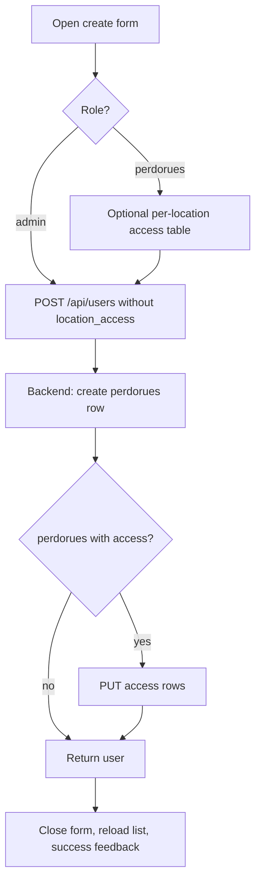
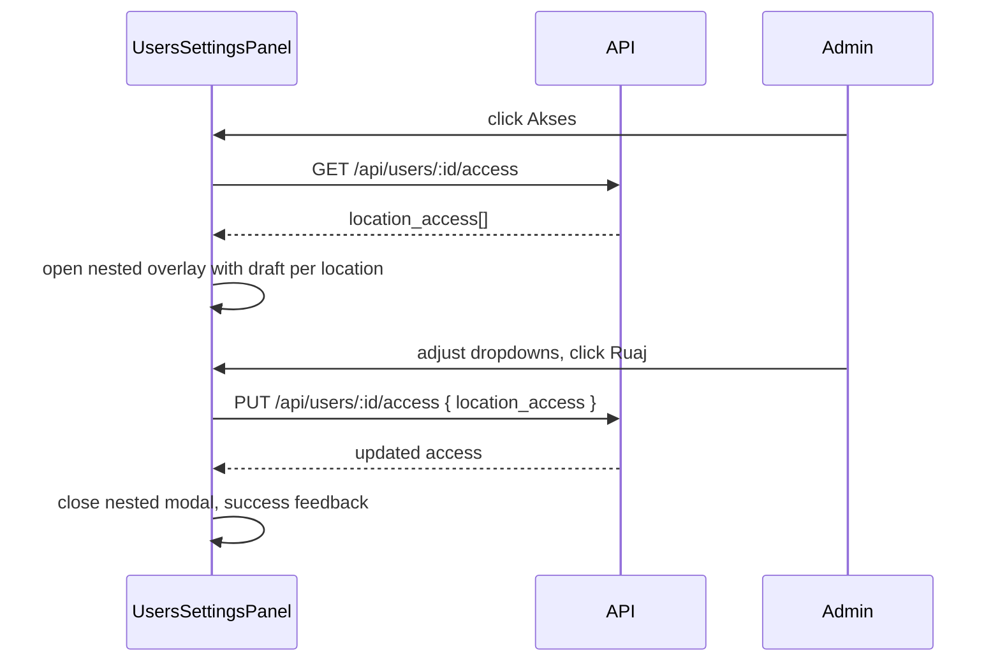
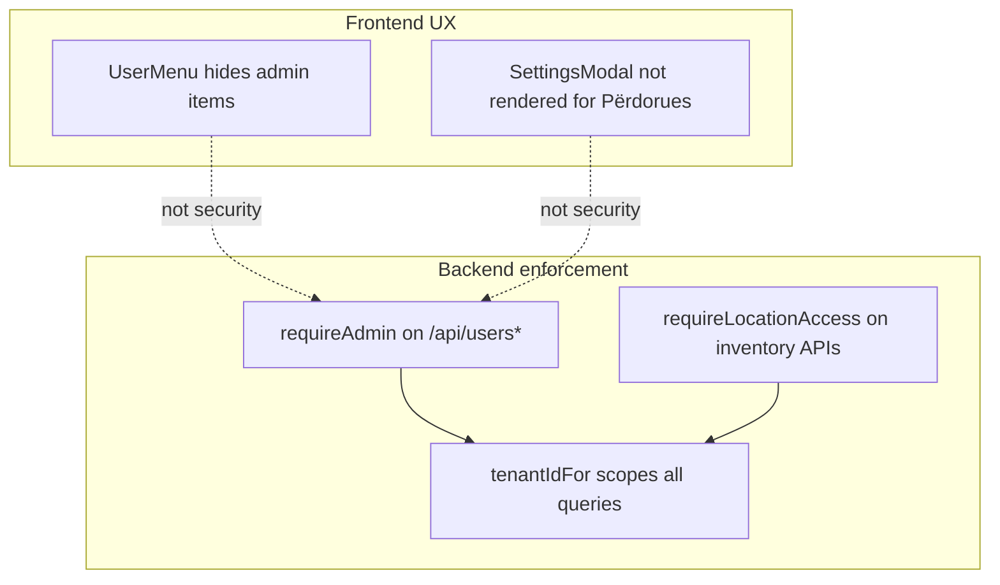

# Settings Modal — Purpose and Detailed Flows

This document describes **what we are building** with the top-right user menu and settings modal in Inventari, and **every process** from UI interaction through backend enforcement.

It is the source of truth for **this product’s** implementation. The older `SETTINGS_MODAL_FRONTEND_BACKEND.md` at the repo root describes a similar UX pattern from another context (People + Invitations). Inventari uses **direct user creation** and **per-location access**, not email invitations.

---

## 1. What we are trying to do

### Problem

Before the modal, desktop admins had three separate controls fixed in the top-right corner:

- **Përdorues** — link to `/settings/users`
- **Vendndodhjet** — link to `/settings/locations`
- **Dil** — logout button

That pattern:

- Clutters the dashboard header.
- Navigates away from the main inventory UI.
- Feels unlike the polished modal pattern used elsewhere (history modal, confirm dialogs).

### Goal

Replace those controls with a **single user menu** that:

1. Shows who is logged in (name, role, avatar initials).
2. Exposes admin settings as **menu items** that open a **modal overlay** on top of the dashboard — the user never leaves the main panel.
3. Keeps **Dil** (logout) in the same menu for everyone.
4. Hides admin-only entries from non-admin users in the UI, while the backend still enforces admin access on every API call.

### What the modal manages

| Tab | Albanian label | Admin can… |
| --- | --- | --- |
| **Users** | Përdorues | List users, create users, change roles, assign per-location access, deactivate users |
| **Locations** | Vendndodhjet | Manage locations and view tenant configuration (same as old settings page) |

### What the modal does **not** do (yet)

- Email invitations (no invite/accept flow).
- Pagination or search on the user list (loads all account users in one request).
- Mobile settings modal (mobile still uses its own shell; desktop only for now).
- Settings for **legacy** dashboard users (legacy shell shows menu + logout only).

---

## 2. Roles and permissions model

Every flow below assumes this data model (see `docs/sql/18_user_roles_location_access.sql`).

### Platform roles

| Role | DB value | Meaning |
| --- | --- | --- |
| **Admin** | `admin` | Full access to the whole account (all locations, all actions, user management). |
| **Përdorues** | `perdorues` | Scoped by per-location access rows. |

### Account ownership

- Each user belongs to an **account** via `perdorues.account_owner_id`.
- All locations, products, and actions for that account are scoped to `account_owner_id` (not the individual user id).
- The account owner is typically the first user; additional users share the same `account_owner_id`.

### Per-location access (`lokacioni_perdorues_access`)

Only applies to **Përdorues** users. Admins ignore this table.

| Access level | DB value | Can view | Can add | Can edit/delete |
| --- | --- | --- | --- | --- |
| Pa akses | *(no row)* | No — location hidden | No | No |
| Shiko | `view` | Yes | No | No |
| Shto | `add` | Yes | Yes | No |
| Ndrysho/Fshi | `edit_delete` | Yes | Yes | Yes |

Higher levels include lower ones (`edit_delete` ⊃ `add` ⊃ `view`).

### Who sees the menu items

| User type | User menu shows | Settings modal |
| --- | --- | --- |
| Admin | Përdorues, Vendndodhjet, Dil | Can open |
| Përdorues | Dil only | Cannot open (not rendered) |
| Legacy user | Dil only | Cannot open |

Frontend hiding is **UX only**. Backend `requireAdmin()` on `/api/users*` and location admin guards are the real security boundary.

---

## 3. Component architecture

```
desktop-shell (DynamicDashboardShell)
├── app-actions (fixed top-right)
│   └── UserMenu
│       ├── trigger (avatar + name + role)
│       └── dropdown
│           ├── Përdorues  ──► openSettings('users')
│           ├── Vendndodhjet ──► openSettings('locations')
│           └── Dil        ──► onLogout()
│
├── main.container
│   └── DynamicDashboardPage  (stays mounted under modal)
│
└── SettingsModal (portal → document.body, admin only)
    ├── header (title, refresh, close)
    ├── tabs (Përdorues | Vendndodhjet)
    └── body (scrollable)
        ├── UsersSettingsPanel   (tab === 'users')
        └── LocationsSettingsPanel (tab === 'locations')
```

### State ownership

| State | Owner | Notes |
| --- | --- | --- |
| `settingsOpen: boolean` | `DynamicDashboardShell` | Whether modal is visible |
| `settingsTab: 'users' \| 'locations'` | `DynamicDashboardShell` | Active tab; set by menu item or deep link |
| `refreshToken: number` | `SettingsModal` | Incremented by header refresh; passed to `UsersSettingsPanel` |
| User list, forms, nested access editor | `UsersSettingsPanel` | Self-contained panel state |
| Location list edits | `LocationsEditor` inside `LocationsSettingsPanel` | Reuses existing location editor |

### Key files

| File | Role |
| --- | --- |
| `frontend/src/components/UserMenu.tsx` | Top-right dropdown |
| `frontend/src/features/settings/SettingsModal.tsx` | Modal shell + tabs |
| `frontend/src/features/settings/UsersSettingsPanel.tsx` | User management UI |
| `frontend/src/features/settings/LocationsSettingsPanel.tsx` | Locations + tenant config |
| `frontend/src/App.tsx` | Wires menu, modal state, deep-link routes |
| `frontend/src/lib/api/users.ts` | REST client for user APIs |
| `backend/src/routes/users.ts` | HTTP routes |
| `backend/src/services/userManagementService.ts` | Business rules |
| `backend/src/services/accessControlService.ts` | `requireAdmin`, location guards |

### Embed vs full page

`UsersSettingsPanel` and `LocationsSettingsPanel` accept `embedded?: boolean`.

- **Embedded** (`embedded={true}`): used inside the modal; compact toolbar, no page chrome.
- **Full page**: `UsersSettingsPage` / `LocationsSettingsPage` still exist for direct rendering, but routes `/settings/*` now redirect to home + open modal instead.

---

## 4. Modal UX contract

The modal follows the same shell pattern as `HistoryModal` and the reference doc:

| Behavior | Implementation |
| --- | --- |
| Render above dashboard | `createPortal(..., document.body)` |
| Backdrop click closes | `handleOverlayDismiss` on overlay |
| Escape closes | `useEscapeToClose` |
| Focus trap on open | `useFocusModalOnOpen` |
| Dashboard stays underneath | No route change; `DynamicDashboardPage` remains mounted |
| Internal scroll | `modal-fluid` + `modal-fluid-scroll` on body |
| Refresh | Header button increments `refreshToken` → Users tab reloads list |
| Close | × button or backdrop/Escape → `settingsOpen = false` |

On close, `refreshToken` resets to `0`. Tab choice is **not** reset (next open keeps last tab unless menu item sets a specific tab).

---

## 5. Detailed process flows

### 5.1 App load → dashboard with user menu



**Steps:**

1. User hits `/` after login.
2. `ProtectedHome` resolves auth, onboarding, and `uiLloji`.
3. For dynamic desktop users, `DynamicDashboardShell` renders:
   - `UserMenu` in `.app-actions`
   - `DynamicDashboardPage` in `<main>`
   - `SettingsModal` only if `isAdmin(user)` (initially closed).

---

### 5.2 Open user menu dropdown

**Trigger:** Click the pill button (avatar + name + chevron) in the top-right.

**Steps:**

1. `UserMenu` toggles local `open` state.
2. Dropdown renders below trigger with:
   - Header: display name + email
   - Admin only: **Përdorues**, **Vendndodhjet**, divider
   - Everyone: **Dil**
3. Click outside dropdown → `mousedown` listener closes menu.
4. Press Escape → `useEscapeToClose` closes menu.

**Display name rule:** `emri` → else `email` → else `"Përdorues"`.

**Avatar initials:** First letters of first two words, or first two characters of name.

---

### 5.3 Open settings modal from menu

**Trigger:** Admin clicks **Përdorues** or **Vendndodhjet** in dropdown.



**Steps:**

1. Menu closes.
2. `openSettings(tab)` in shell sets `settingsTab` and `settingsOpen = true`.
3. `SettingsModal` portals to `document.body`.
4. Active tab panel mounts:
   - **Users tab:** `UsersSettingsPanel` calls `GET /api/users` unless cached data is already warm.
   - **Locations tab:** `LocationsSettingsPanel` renders the settings-mode `LocationsEditor`.

**Important:** Dashboard does not unmount. User can close modal and continue inventory work immediately.

---

### 5.4 Deep link: `/settings/users` or `/settings/locations`

**Purpose:** Old bookmarks and links still work.



**Steps:**

1. Route `OpenSettingsRedirect` runs `Navigate to="/" replace state={{ openSettings: tab }}`.
2. `ProtectedHome` reads `location.state.openSettings`.
3. `DynamicDashboardShell` initializes:
   - `settingsOpen = Boolean(initialSettingsTab)`
   - `settingsTab = initialSettingsTab ?? 'users'`
4. Modal opens automatically for admins on dashboard load.

**Note:** Non-admins hitting these URLs land on `/` with state but modal is not rendered (`admin ? SettingsModal : null`).

---

### 5.5 Switch tabs inside modal

**Trigger:** Click **Përdorues** or **Vendndodhjet** tab in modal header area.

**Steps:**

1. `onTabChange(tab)` updates `settingsTab` in shell.
2. Modal body swaps panel component.
3. **Users → Locations:** user list state stays in React tree but panel unmounts (will reload on return).
4. **Locations → Users:** `UsersSettingsPanel` remounts and calls `loadUsers()` again.

Tab state persists while modal stays open. Refresh button only affects Users tab (via `refreshToken`).

---

### 5.6 Refresh users list

**Trigger:** Click refresh icon in modal header.

**Steps:**

1. `setRefreshToken(n => n + 1)` in `SettingsModal`.
2. `UsersSettingsPanel` `useEffect` depends on `refreshToken` → calls `loadUsers()`.
3. Loading state shows "Duke ngarkuar…" in users card.

Locations tab is not affected by refresh token (locations editor has its own save/reload behavior).

---

### 5.7 Close modal

**Triggers:** × button, backdrop click (outside content), Escape.

**Steps:**

1. `onClose()` → `setSettingsOpen(false)` in shell.
2. `SettingsModal` returns `null` (unmounts portal).
3. `useEffect` in modal resets `refreshToken` to `0`.
4. Dashboard fully interactive again; no navigation occurred.

---

### 5.8 List users (Përdorues tab)

**When:** Tab opens, refresh clicked, or after create/delete success.



**UI shows per row:**

| Column | Content |
| --- | --- |
| Emri | Name + **Ti** badge if current user |
| Email | Email or — |
| Roli | Dropdown (others) or static label (self) |
| Statusi | Aktiv / Çaktivizuar |
| Actions | **Akses** (perdorues only), **Fshi** (not self) |

**Backend scope:** Only users where `account_owner_id = tenantIdFor(actor)`.

---

### 5.9 Create user

**Trigger:** Click **+ Shto përdorues** in embedded toolbar → fill form → **Krijo**.



**Form fields:**

| Field | Required | Notes |
| --- | --- | --- |
| Emri | Yes | Unique per platform |
| Email | No | Must be unique if provided |
| Fjalëkalimi | Yes | Min 8 characters |
| Roli | Yes | Admin or Përdorues |
| Aksesi sipas vendndodhjes | Përdorues only | One dropdown per location |

**Frontend steps:**

1. Validate HTML5 required fields.
2. Build `location_access` array from non-empty location dropdowns (Përdorues only).
3. `POST /api/users` with body `{ emri, email?, password, role, location_access? }`.
4. On success: close form, clear fields, show green feedback, `loadUsers()`.
5. On error: show `ErrorAlert` with API message.

**Backend steps (`createManagedUser`):**

1. `requireAdmin(actor)`.
2. Parse body with `CreateManagedUserBodySchema`.
3. Reject duplicate `emri` or `email`.
4. Hash password, insert `perdorues` with `account_owner_id = tenantIdFor(actor)`.
5. If role is `perdorues` and `location_access` provided:
   - Validate each `lokacioni_id` belongs to account.
   - `replaceAccessForPerdorues(...)`.
6. Return `ManagedUser`.

**New user login:** User can log in immediately with emri/email + password. Session will include `role` and `locationAccess` from DB.

---

### 5.10 Change user role

**Trigger:** Admin changes role `<select>` on another user's row.

**Restrictions (frontend + backend):**

- Cannot change **own** role (dropdown disabled for self).
- Changing to **admin** means location access is ignored going forward.
- Changing to **perdorues** does not auto-open access editor; admin should set access separately.

**Steps:**

1. `PATCH /api/users/:id` with `{ role: 'admin' | 'perdorues' }`.
2. Backend `updateManagedUser`:
   - `requireAdmin`.
   - Reject if `userId === actor.id` and role change would demote self.
   - Update `perdorues.role`.
3. Frontend replaces row in local `users` state.
4. Success feedback: "Roli u perditesua."

**Effect on target user:** Existing session keeps old claims until re-login or session refresh (if implemented). Backend always reads fresh DB on each request via session build — verify `authService` rebuilds role from DB per request.

---

### 5.11 Edit per-location access (nested sub-modal)

**Trigger:** Click **Akses** on a **Përdorues** row (not shown for Admin rows).



**Steps:**

1. Initialize draft: all locations → `Pa akses`, then overlay API values.
2. Nested `modal-overlay-stacked` opens **on top of** settings modal.
3. Admin sets each location to Pa akses / Shiko / Shto / Ndrysho/Fshi.
4. **Ruaj** → `PUT /api/users/:id/access` with full replacement array (only entries with access need be sent; empty = no access).
5. Backend:
   - Reject if target is `admin`.
   - Validate location ids belong to account.
   - Replace all rows in `lokacioni_perdorues_access` for that user.
6. Close nested modal.

**Effect on target Përdorues:**

- Locations with no access disappear from their dashboard location picker.
- Action buttons enable/disable per `frontend/src/lib/permissions.ts` helpers.
- Backend enforces same rules via `requireLocationAccess` on mutations.

---

### 5.12 Deactivate user (Fshi)

**Trigger:** Click **Fshi** on another user's row → confirm dialog → confirm.

**Steps:**

1. `ConfirmModal` asks for confirmation.
2. `DELETE /api/users/:id`.
3. Backend `deleteManagedUser`:
   - `requireAdmin`.
   - Reject self-delete.
   - Delete access rows for user.
   - Set `aktiv = false` (soft delete, not hard delete).
4. Frontend reloads list, shows "Përdoruesi u çaktivizua."

Deactivated users cannot log in (auth layer should reject `aktiv = false`).

---

### 5.13 Locations tab

**Trigger:** Open modal on **Vendndodhjet** tab or switch to it.

**Content:**

1. **`LocationsEditor`** with `mode="settings"`:
   - List active and recently deactivated locations in flat rows.
   - Inline rename.
   - Add new location.
   - Deactivate/reactivate locations (settings mode only).
   - Soft-delete locations through **Fshi**; this marks the row inactive/hidden while keeping historical data intact.
   - Hide reorder controls and **Shfaq në Përmbledhje** from the embedded modal view.

**Permission:** Admin only (same as before standalone settings page). Uses existing location APIs guarded by `requireAdmin` / tenant scope.

**Flow:** Uses the existing location APIs and editor logic, but the embedded modal view removes tenant-config display and presents the list in a compact row layout with a total count.

---

### 5.14 Logout (Dil)

**Trigger:** Click **Dil** in user menu (admin or non-admin).

**Steps:**

1. Menu closes.
2. `onLogout()` → `auth.logout()` in `ProtectedHome`.
3. Session cleared; redirect to login on next navigation.

Works the same whether or not settings modal was open. If modal was open, shell unmounts on logout.

---

### 5.15 Non-admin (Përdorues) experience

**Steps:**

1. `UserMenu` renders trigger only; `isAdmin` is false.
2. Dropdown shows header + **Dil** only.
3. `SettingsModal` is not mounted in shell.
4. Deep link to `/settings/users` redirects to `/` but modal does not open.

If a Përdorues somehow calls `/api/users`, backend returns **403 Admin access required**.

---

## 6. Backend API contract (settings modal)

All routes under `/api/users`, session cookie required.

| Operation | Method | Path | Used by |
| --- | --- | --- | --- |
| List users | `GET` | `/api/users?search=` | Users tab load / refresh |
| Create user | `POST` | `/api/users` | Create form |
| Update user | `PATCH` | `/api/users/:id` | Role dropdown |
| Deactivate user | `DELETE` | `/api/users/:id` | Fshi confirm |
| Get access | `GET` | `/api/users/:id/access` | Akses editor open |
| Replace access | `PUT` | `/api/users/:id/access` | Akses editor save |

Shared types: `packages/shared/src/schemas/access.ts`.

---

## 7. Security boundaries



**Rules:**

1. Never trust frontend role checks for authorization.
2. Every user-management mutation calls `requireAdmin(actor)`.
3. Inventory operations use `requireLocationAccess` with minimum level (`view`, `add`, `edit_delete`).
4. Admins bypass location checks; Përdorues is limited to `locationAccess` on session.
5. Users are always listed/mutated within `account_owner_id` of the actor.

---

## 8. Database prerequisites

The modal’s user features require SQL migration:

**File:** `docs/sql/18_user_roles_location_access.sql`

**Must be run manually** in Supabase SQL editor before multi-user features work in production.

It adds:

- `perdorues.role` (`admin` | `perdorues`)
- `perdorues.account_owner_id`
- `lokacioni_perdorues_access` table
- Backfill: existing users → account owner + admin

Until this runs, role/access columns may be missing and APIs can fail.

---

## 9. Differences from `SETTINGS_MODAL_FRONTEND_BACKEND.md`

| Topic | Reference doc | Inventari implementation |
| --- | --- | --- |
| Tabs | People + Invitations | Përdorues + Vendndodhjet |
| Adding users | Email invitation flow | Direct create with password |
| Access model | Admin / Employee role only | Admin / Përdorues + per-location access levels |
| List UX | Paginated + debounced search | Full list per account |
| Menu entry | Single "Settings" item | Separate **Përdorues** and **Vendndodhjet** items |
| Locations | Not in modal | Dedicated tab with `LocationsEditor` |

The **pattern** is the same: user menu → portal modal → tabbed admin tools → centralized mutations → backend `requireAdmin`.

---

## 10. Future extensions (not implemented)

When extending the modal, keep these conventions:

1. **New admin tab:** Add to `SettingsTab` union, tab button in `SettingsModal`, new `*SettingsPanel` component.
2. **New mutation:** Add API route + service rule + panel UI; never frontend-only enforcement.
3. **Invitations:** Would be a third tab or replace direct create; needs new tables and public accept route.
4. **Mobile:** Reuse `UserMenu` + `SettingsModal` in `DynamicMobileApp` or a bottom-sheet variant.
5. **Session refresh after access change:** Consider pushing updated `locationAccess` to active sessions when admin changes the logged-in user's access.

---

## 11. Quick reference — user journey map

```
Login
  └─► Dashboard (/)
        └─► Click user pill (top-right)
              ├─► [Admin] Përdorues
              │     └─► Settings modal → Users tab
              │           ├─► List / refresh users
              │           ├─► + Shto përdorues → create
              │           ├─► Role select → PATCH user
              │           ├─► Akses → nested editor → PUT access
              │           └─► Fshi → confirm → DELETE (deactivate)
              │
              ├─► [Admin] Vendndodhjet
              │     └─► Settings modal → Locations tab
              │           └─► LocationsEditor (rename/add/deactivate/reactivate/soft-delete)
              │
              └─► Dil → logout → /login

Bookmark /settings/users or /settings/locations
  └─► Redirect to / → modal opens on correct tab [Admin only]
```

This is the complete intended behavior of the settings modal system in Inventari.
